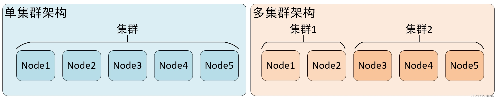
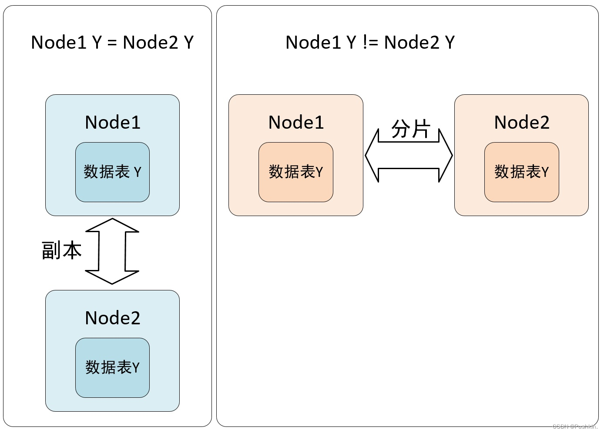
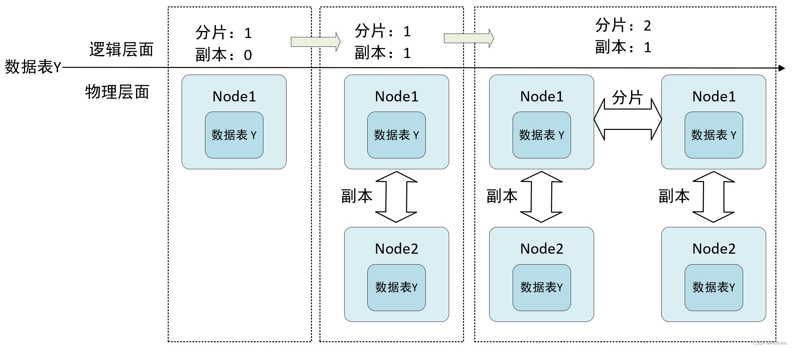
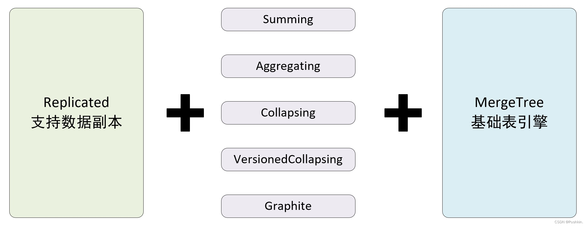
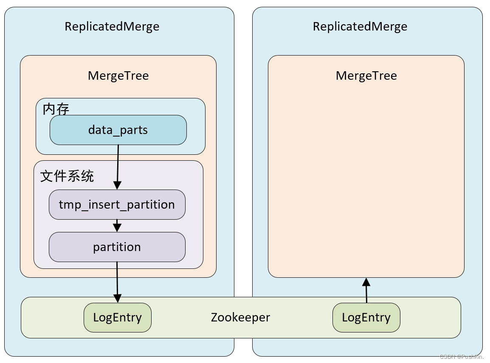
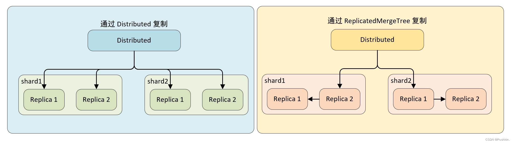

# zookeeper+clickhouse集群环境搭建
* `特别说明`：切换单机或集群需要删除data和logs下的目录数据，不然来回切换不同集群的时候可能会有遗留的旧数据
* cp example.env .env
* cp docker-compose-example.yml docker-compose.yml

# zookeeper集群配置

## 查看节点的状态
### 容器启动顺序为zookeeper1, zookeeper2, zookeeper3
### 分别执行命令 `bin/zkServer.sh status`
```shell
### 在zookeeper1里面会输出:
Mode: follower

### 在zookeeper2里面会输出:
Mode: leader

### 在zookeeper3里面会输出:
Mode: follower
```
## 选举说明
三个节点都启动成功，且因为启动循序是zk1, zk2, zk3，所以根据zk的选举算法，选举zk2为leader，其他的为follower。
选举过程:
* 启动zookeeper1(myid=1)，投自己一票，此时因为集群大小为3，不够半数票，无法完成选举，所以状态为LOOKING
* 启动zookeeper2(myid=2)，zookeeper2投自己一票并发起选举，zookeeper1发现zookeeper2的myid比自己的大，所以把选票投给zookeeper2，此时zookeeper2的选票为2，超过了集群大小的一半，选举结束，zookeeper2为leader，zookeeper1为follower
* 启动zookeeper3(myid=3), zookeeper3投自己一票，zookeeper1,zookeeper2由于不是LOOKING状态，不会改变选票，所以zookeeper3为follower

## 查看配置文件
分别进入容器执行 `cat /conf/zoo.cfg`

# clickhouse
## 基础知识
### 分片与副本
* 集群是副本和分片的基础，它将 clickhouse 的服务拓扑由单节点延伸到多个节点
* clickhouse 集群配置很灵活，既可以将所有节点组成一个单一的大集群，也可以按照业务需求，把节点划分为多个小集群
* 在每个小集群区域之间，它们的节点、分区和副本数量可以各不相同
* 

### 分片与副本的区别
* 从数据层面上区分，假设 clickhouse 有 N 个节点，在集群的各个节点上都有一张结构相同的数据表 Y , 如果 N1,N2 两个节点的数据完全相同，则互为副本，如果数据完全不同则互为分片。
* 从功能层面上看，副本的主要目的是为了防止数据丢失，而数据分片是为了实现数据的水平切分。
* 

### 数据副本对比(MergeTree系列引擎)
* 如果在 MergeTree 表引擎前面加上 Replicated 前缀，就能够组合成一个新的引擎即 Replicated-mergeTree 复制表。
* 
* 只有使用了 ReplicatedMergeTree 系列复制表引擎才能使用副本。ReplicatedMergeTree是 MergeTree 的派生表引擎，在 MergeTree 的基础上加入了分布式协同能力。
* 
* 
* 在 MergeTree 中，一个分区由开始创建到全部完成会经历两个存储区域
  1. 内存：数据首先会被写入内存缓存区
  2. 本地磁盘：数据接着会被写入到tmp 临时目录分区，待全部完成后，再将临时目录重命名为正式分区
* ReplicatedMergeTree 在上述基础上增加了 zookeeper 的部分，它会进一步在 zookeeper 内部创建一系列的监听节点，并以此实现多个实例之间的通信，在整个通信过程中 zookeeper 并不会设计数据的传输

### 数据副本的特点
* 依赖 zookeeper：在执行 insert 和 alert 查询的时候，ReplicatedMergeTree 需要借助 zookeeper 的分布式协调能力，以实现多个副本之间的数据同步，但是在查询的时候，并不需要使用 zookeeper。
* 表级别的副本：副本是在表级别定义的，所以每张表的副本配置都可以按照它的实际需求进行个性化，包括副本数量，以及副本在集群内的分布式位置等。
* 多主架构（Multi Master）：可以在任意一个副本上执行 insert 和 alter 查询，他们的效果是相同的，这些操作会借助 zookeeper 的协调能力被分发至每个副本以本地形式执行。
* Block 数据块：在执行 insert 命令时，会依据 max_insert_block_size 的大小（默认 1048576 行）将数据切分成若干个 Block 数据块。所以数据块是数据写入的基本单元，并且具有写入的原子性和唯一性。
* 原子性：在数据写入时，一个 Block 块内的数据要么全部写入成功，要么全部失败。
* 唯一性：在写入一个 Block 数据块的时候，会按照当前的 Block 数据块的数据顺序、数据行和数据大小等指标计算 Hash 信息摘要记录。在此之后，如果某个待写入的 Block 数据块与先前已被写入的 Block 数据块拥有相同的 Hash 摘要，则该 Block 数据块会被忽略，这个设计可以预防由于异常原因引起的 Block 数据块重复写入的问题。

## clickhouse集群配置
* 特殊说明：切换下面不同集群的时候需要把 ./data/clickhouse  和 ./data/zookeeper 目录删除。不然数据可能会错乱
* 机器数量=分片数+分配数*副本数，比如2分片1副本需要的机器数：`2+2*1`=4，需要4台clickhouse机器,下面示例

### 2分片0副本(cluster2s0r)
* 2台机器docker-compose.yml 里面打开clickhouse1、clickhouse2,其他4台注释掉
* .env里面clickhouse集群配置只打开:`CLUSTER_DIR=cluster2s0r`,其他注释
* 启动：docker-compose up -d
* 测试：

```clickhouse
-- 1.在clickhouse1中建MergeTree表（ on cluster cluster_2s0r 这个等同于在两台集群里分别执行了建表语句）
create table cluster_2s0r_UserTest on cluster cluster_2s0r
(
  ts  DateTime,
  uid String,
  biz String
)
engine = MergeTree
PARTITION BY toYYYYMMDD(ts)
ORDER BY ts
SETTINGS index_granularity = 8192;

-- 2.上面执行后分别在两台机器上,看都有建表成功
show tables;

-- 3.插入数据
-- 3.1 第一台机器执行
insert into  cluster_2s0r_UserTest values ('2023-08-16 17:00:00',1,1);
insert into  cluster_2s0r_UserTest values ('2023-08-16 17:00:00',2,1);
insert into  cluster_2s0r_UserTest values ('2023-08-16 17:00:00',3,1);
-- 3.2 第二台机器执行
insert into  cluster_2s0r_UserTest values ('2023-08-16 17:00:00',4,1);
insert into  cluster_2s0r_UserTest values ('2023-08-16 17:00:00',5,1);
insert into  cluster_2s0r_UserTest values ('2023-08-16 17:00:00',6,1);
-- 3.3 两台机器执行下面语句，可以看到两边的表各有3条数据
select * from cluster_2s0r_UserTest;

-- 4.第一台创建分布式表（哪台机器创建都行）
CREATE TABLE cluster_2s0r_UserTest_All
  ON CLUSTER cluster_2s0r AS cluster_2s0r_UserTest
  ENGINE = Distributed(cluster_2s0r, default,  cluster_2s0r_UserTest, rand());
-- 4.1两台机器分别执行下面语句，可以看到可以看到6条数据（两台机器本地表合起来了）
select * from cluster_2s0r_UserTest_All;
-- 4.2再次测试，两台机器分别执行下面各一条语句,重复上面4.1查询也都会有新的一行数据
insert into  cluster_2s0r_UserTest values ('2023-08-16 17:00:00',11,1);
insert into  cluster_2s0r_UserTest values ('2023-08-16 17:00:00',41,1);
-- 4.3向第一台机器分布式表插入数据，由于我们分片key填的事rand(),可以看到有些数据会分到另一台机器的本地表cluster_2s0r_UserTest中
insert into  cluster_2s0r_UserTest_All values ('2023-08-16 17:00:00',99,1);
insert into  cluster_2s0r_UserTest_All values ('2023-08-16 17:00:00',100,1);
insert into  cluster_2s0r_UserTest_All 
              values ('2023-08-16 17:00:00',110,1),
                     ('2023-08-16 17:00:00',111,1),
                     ('2023-08-16 17:00:00',112,1),
                     ('2023-08-16 17:00:00',113,1),
                     ('2023-08-16 17:00:00',114,1),
                     ('2023-08-16 17:00:00',115,1),
                     ('2023-08-16 17:00:00',116,1),
                     ('2023-08-16 17:00:00',117,1),
                     ('2023-08-16 17:00:00',118,1);
-- 4.4分别在两台机器查看本地表
select * from cluster_2s0r_UserTest;

-- 5.可以手动执行合并
optimize table cluster_2s0r_UserTest;
```

### 2分片1副本(cluster2s1r)
每个分片有一个副本
#### 查看集群状态
```shell
#进入clickhouse容器，clickhouse-client命令行执行
select * from system.clusters;
```
* 4台机器docker-compose.yml 里面打开clickhouse1、clickhouse2、clickhouse3、clickhouse4,其他2台注释掉
* 分片：01、02作为第一组分片，03、04作为第二组分片
* 副本：01、02作为另一个的副本，03、04为另一个的副本
* .env里面clickhouse集群配置只打开:`CLUSTER_DIR=cluster2s1r`,其他注释
* 启动：docker-compose up -d
* 测试：
```clickhouse
-- 1.在clickhouse1中建MergeTree表（ on cluster cluster_2s1r 这个等同于在四台机器里分别执行了建表语句）
create table cluster_2s1r_UserTest on cluster cluster_2s1r
(
  ts  DateTime,
  uid String,
  biz String
)
engine = MergeTree()
PARTITION BY toYYYYMMDD(ts)
ORDER BY ts
SETTINGS index_granularity = 8192;

-- 2.创建分布式表
CREATE TABLE cluster_2s1r_UserTest_All
ON CLUSTER cluster_2s1r AS cluster_2s1r_UserTest
ENGINE = Distributed(cluster_2s1r, default,  cluster_2s1r_UserTest, rand());

-- 3.插入数据到分布式表
insert into  cluster_2s1r_UserTest_All
values ('2023-08-16 17:00:00',110,1),
       ('2023-08-16 17:00:00',111,2),
       ('2023-08-16 17:00:00',112,3),
       ('2023-08-16 17:00:00',113,4),
       ('2023-08-17 17:00:00',114,5),
       ('2023-08-17 17:00:00',115,6),
       ('2023-08-17 17:00:00',116,7),
       ('2023-08-17 17:00:00',117,8),
       ('2023-08-17 17:00:00',118,9),
       ('2023-08-18 17:00:00',120,10),
       ('2023-08-18 17:00:00',121,11),
       ('2023-08-18 17:00:00',122,12),
       ('2023-08-18 17:00:00',123,13),
       ('2023-08-19 17:00:00',124,14),
       ('2023-08-19 17:00:00',125,15),
       ('2023-08-19 17:00:00',126,16),
       ('2023-08-19 17:00:00',127,17),
       ('2023-08-19 17:00:00',128,18);
-- 4.查看数据
-- 4.1 查询cluster_2s1r_UserTest表：第一台机有12条数据、第二台机器没有数据、第三台机器没有数据、第四台机器6条数据
-- 4.2 查询cluster_2s1r_UserTest_All表：第一台机有18条数据、第二台机器没有数据、第三台机器没有数据、第四台机器18条数据

-- 5.创建ReplicatedMergeTree表
create table cluster_2s1r_UserTestRep on cluster cluster_2s1r
(
  ts  DateTime,
  uid String,
  biz String
)
ENGINE=ReplicatedMergeTree('/clickhouse/table/{shard}/cluster_2s1r_UserTestRep', '{replica}') 
PARTITION BY toYYYYMMDD(ts) 
ORDER BY (ts);

-- 6.创建分布式表
CREATE TABLE cluster_2s1r_UserTestRep_All
ON CLUSTER cluster_2s1r AS cluster_2s1r_UserTestRep
ENGINE = Distributed(cluster_2s1r, default,  cluster_2s1r_UserTestRep, rand());

-- 7.插入数据到分布式表
insert into  cluster_2s1r_UserTestRep_All
values ('2023-08-16 17:00:00',110,1),
       ('2023-08-16 17:00:00',111,2),
       ('2023-08-16 17:00:00',112,3),
       ('2023-08-16 17:00:00',113,4),
       ('2023-08-17 17:00:00',114,5),
       ('2023-08-17 17:00:00',115,6),
       ('2023-08-17 17:00:00',116,7),
       ('2023-08-17 17:00:00',117,8),
       ('2023-08-17 17:00:00',118,9),
       ('2023-08-18 17:00:00',120,10),
       ('2023-08-18 17:00:00',121,11),
       ('2023-08-18 17:00:00',122,12),
       ('2023-08-18 17:00:00',123,13),
       ('2023-08-19 17:00:00',124,14),
       ('2023-08-19 17:00:00',125,15),
       ('2023-08-19 17:00:00',126,16),
       ('2023-08-19 17:00:00',127,17),
       ('2023-08-19 17:00:00',128,18);

-- 8.查看数据
-- 8.1 查询cluster_2s2r_UserTestRep表：第一台机有12条数据、第二台机器12条数据、第三台机器6条数据、第四台机器6条数据
-- 8.2 查询cluster_2s2r_UserTestRep_All表：四台机器都有18条数据

```
* 副本复制的流程
* 
* 两种方式复制
* 通过 Distributed 复制数据
  * 在这种实现方式下，即使本地表不使用 ReplicatedMergeTree 表引擎，也能实现数据副本的功能，Distributed 会同时负责副本与分片的数据写入工作，而副本的写入流程与分片的写入流程相同，这种情况下，Distributed 节点的写入性能可能成为瓶颈。
* 通过 ReplicatedMergeTree 复制数据
  * 如果在集群的 shard 配置中增加设置 internal_replication = true，那么 Distributed 将在没每个分片只写一份数据，不负责其副本的写入，如果此时，本地表使用的是 ReplicatedMergeTree 表引擎，那么在 shard 内的多个副本会由 ReplicatedMergeTree 自己处理

### 2分片2副本
每个分片有两个副本
* 需要6台机器,docker-compose.yml 里面打开clickhouse1、clickhouse2、clickhouse3、clickhouse4、clickhouse5、clickhouse6
* 分片：01、02、03作为第一组分片，04、05、06作为第二组分片
* 副本：01、02、03有两个作为另一个的副本，04、05、06有两个作为另一个的副本
* .env里面clickhouse集群配置只打开:`CLUSTER_DIR=cluster2s2r`,其他注释
* 启动：docker-compose up -d
* 查看集群状态
```shell
#进入clickhouse容器，clickhouse-client命令行执行
select * from system.clusters;
```
* 测试：
```clickhouse
-- 1.创建ReplicatedMergeTree表
create table cluster_2s2r_UserTestRep on cluster cluster_2s2r
(
  ts  DateTime,
  uid String,
  biz String
)
ENGINE=ReplicatedMergeTree('/clickhouse/table/{shard}/cluster_2s2r_UserTestRep', '{replica}')
PARTITION BY toYYYYMMDD(ts)
ORDER BY (ts);

-- 6.创建分布式表
CREATE TABLE cluster_2s2r_UserTestRep_All
ON CLUSTER cluster_2s2r AS cluster_2s2r_UserTestRep
ENGINE = Distributed(cluster_2s2r, default,  cluster_2s2r_UserTestRep, rand());

-- 7.插入数据到分布式表
insert into  cluster_2s2r_UserTestRep_All
values ('2023-08-16 17:00:00',110,1),
       ('2023-08-16 17:00:00',111,2),
       ('2023-08-16 17:00:00',112,3),
       ('2023-08-16 17:00:00',113,4),
       ('2023-08-17 17:00:00',114,5),
       ('2023-08-17 17:00:00',115,6),
       ('2023-08-17 17:00:00',116,7),
       ('2023-08-17 17:00:00',117,8),
       ('2023-08-17 17:00:00',118,9),
       ('2023-08-18 17:00:00',120,10),
       ('2023-08-18 17:00:00',121,11),
       ('2023-08-18 17:00:00',122,12),
       ('2023-08-18 17:00:00',123,13),
       ('2023-08-19 17:00:00',124,14),
       ('2023-08-19 17:00:00',125,15),
       ('2023-08-19 17:00:00',126,16),
       ('2023-08-19 17:00:00',127,17),
       ('2023-08-19 17:00:00',128,18);

-- 8.查看数据
-- 8.1 查询cluster_2s2r_UserTestRep表：第一、第二、第三台机数据数据一样且有6条数据,第四、第五、第六台机数据数据一样且有12条数据,
-- 8.2 查询cluster_2s2r_UserTestRep_All表：6台机器都有18条数据
-- 8.3 上述说明两个分片的各两个副本是复制成功的
```

### 3分片1副本 
每个分片有一个副本
#### 查看集群状态
```shell
#进入clickhouse容器，clickhouse-client命令行执行
select * from system.clusters;
```
* 需要6台机器,docker-compose.yml 里面打开clickhouse1、clickhouse2、clickhouse3、clickhouse4、clickhouse5、clickhouse6
* 分片：01、02作为第一组分片，03、04作为第二组分片，05、06作为第三组分片
* 副本：01、02一个作为另一个的副本，03、04一个作为另一个的副本，05、06一个作为另一个的副本
* .env里面clickhouse集群配置只打开:`CLUSTER_DIR=cluster3s1r`,其他注释
* 启动：docker-compose up -d
* 测试：
```clickhouse
-- 1.创建ReplicatedMergeTree表
create table cluster_3s1r_UserTestRep on cluster cluster_3s1r
(
  ts  DateTime,
  uid String,
  biz String
)
ENGINE=ReplicatedMergeTree('/clickhouse/table/{shard}/cluster_3s1r_UserTestRep', '{replica}')
PARTITION BY toYYYYMMDD(ts)
ORDER BY (ts);

-- 2.创建分布式表
CREATE TABLE cluster_3s1r_UserTestRep_All
ON CLUSTER cluster_3s1r AS cluster_3s1r_UserTestRep
ENGINE = Distributed(cluster_3s1r, default,  cluster_3s1r_UserTestRep, rand());

-- 3.插入数据到分布式表
insert into  cluster_3s1r_UserTestRep_All
values ('2023-08-16 17:00:00',110,1),
       ('2023-08-16 17:00:00',111,2),
       ('2023-08-16 17:00:00',112,3),
       ('2023-08-16 17:00:00',113,4),
       ('2023-08-17 17:00:00',114,5),
       ('2023-08-17 17:00:00',115,6),
       ('2023-08-17 17:00:00',116,7),
       ('2023-08-17 17:00:00',117,8),
       ('2023-08-17 17:00:00',118,9),
       ('2023-08-18 17:00:00',120,10),
       ('2023-08-18 17:00:00',121,11),
       ('2023-08-18 17:00:00',122,12),
       ('2023-08-18 17:00:00',123,13),
       ('2023-08-19 17:00:00',124,14),
       ('2023-08-19 17:00:00',125,15),
       ('2023-08-19 17:00:00',126,16),
       ('2023-08-19 17:00:00',127,17),
       ('2023-08-19 17:00:00',128,18);

-- 4.查看数据
-- 4.1 查询cluster_3s1r_UserTestRep表：第一、第二机数据一样且有5条数据,第三、第四台机数据一样且有7条数据,第五、第六台机数据一样且有6条数据,
-- 4.2 查询cluster_3s1r_UserTestRep_All表：6台机器查询都有18条数据
-- 4.3 上述说明三个分片各的副本是复制成功的

-- 5.在第一台机器执行下面语句，第一、二台机器的数据多了一条数据，插入数据正常 
insert into  cluster_3s1r_UserTestRep values ('2023-08-16 17:00:00',8009,1);

```

### 3分片2副本
每个分片有2个副本
* 需要九台机器（机器数=3+3*2）

### 所以n分片n副本都可以自己扩展


